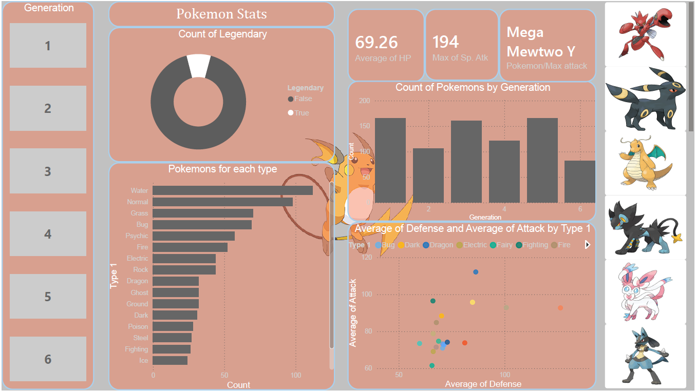
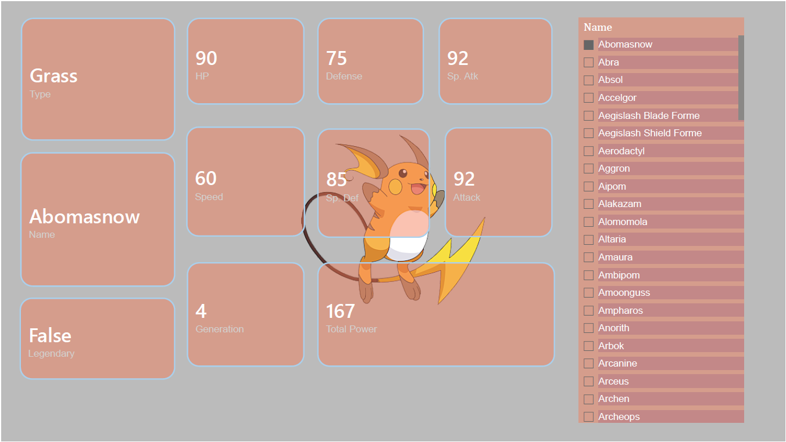

# Pokémon Stats Analysis — Power BI

A multi-page Power BI dashboard analysing stats, types, and generations 
across 800+ Pokémon using the Kaggle Pokémon dataset.

---

## Dashboard Pages

| Page | Description |
|------|-------------|
| Overview | High-level stats — type distribution, legendary count, generation breakdown |
| Pokédex | Individual Pokémon detail card with all base stats |
| Power Analysis | Average total power by generation and legendary breakdown |
| Type Battles | Attack and defense comparison across all types |

---

## Key Findings

- **Generation 4** had the highest average total power across all generations
- **Generation 3** had the highest percentage of Legendary Pokémon
- **Rock type** had the most Pokémon with both Attack and Defense exceeding 100
- **Flying type** had the highest Legendary ratio — 2 out of 4 Flying types are Legendary

---

## Screenshots

### Overview

### Pokédex

### Power Analysis

### Type Battles

---

## Files

| File | Description |
|------|-------------|
| `Pokemon_portfolio.pbix` | Power BI project file — open in Power BI Desktop |
| `pokemon.csv` | Raw dataset sourced from Kaggle |
| `Pokemon github images.xlsx` | Type-to-image URL mapping table used in the dashboard |
| `Screenshots/` | PNG exports of all 4 dashboard pages |

---

## Tools Used
- Power BI Desktop
- DAX
- Microsoft Excel
